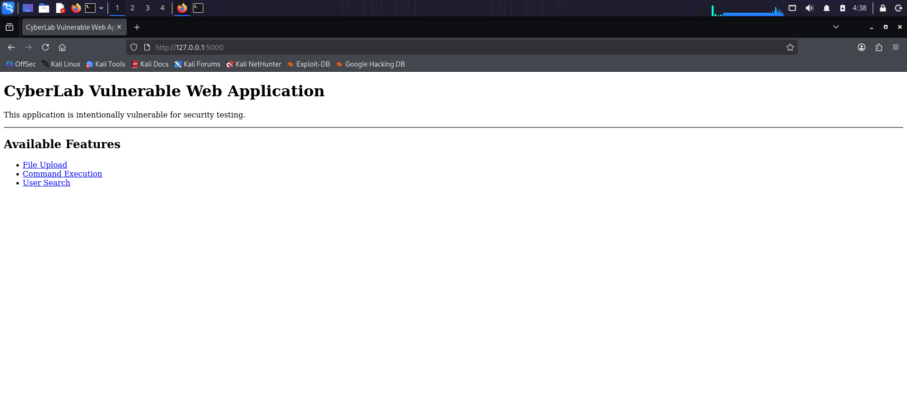
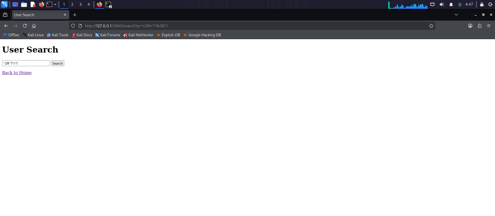
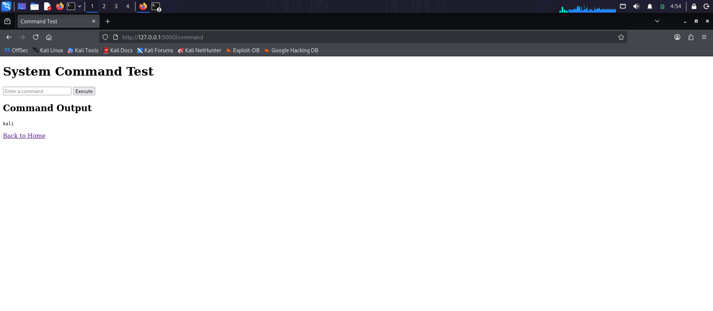
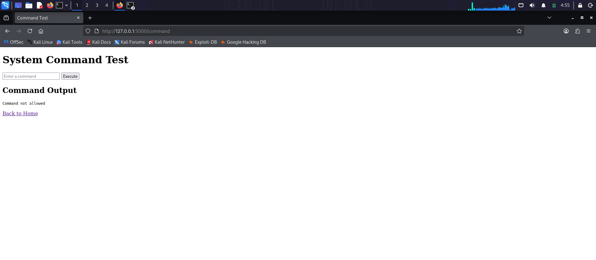
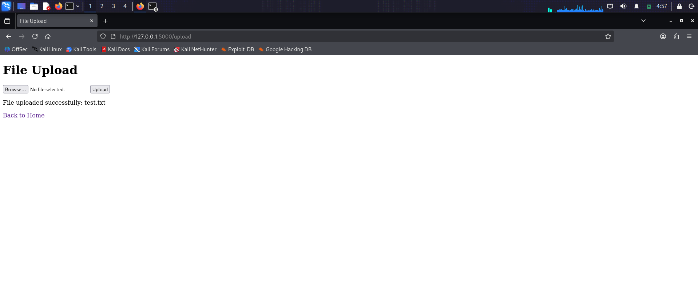
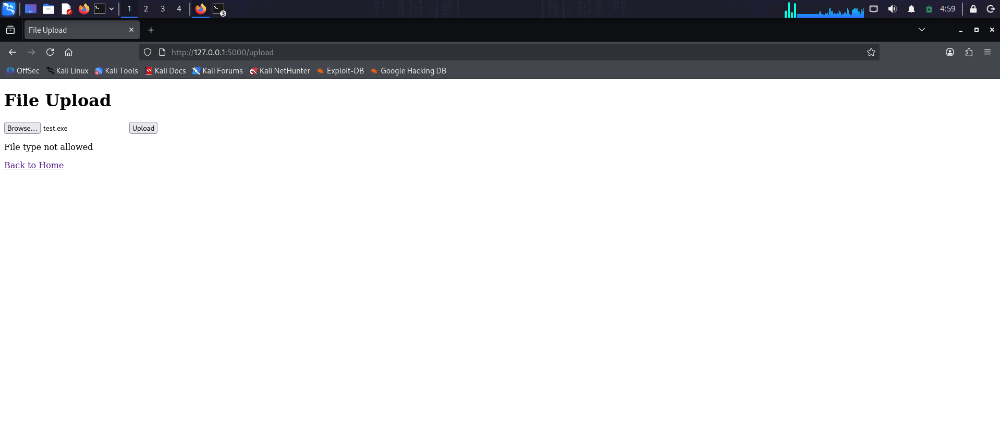

# Attack & Defense Cybersecurity Lab

A practical cybersecurity lab demonstrating vulnerability discovery, security testing, remediation, and defensive security monitoring using a deliberately vulnerable Flask web application.

## Project Overview

This project simulates a real-world attack-and-defense workflow against a Python Flask web application.

The application was initially developed with intentionally vulnerable components for authorized security testing. Each vulnerability was analyzed, tested, remediated, and validated through subsequent security changes.

The project demonstrates the complete security lifecycle:

**Vulnerability → Testing → Remediation → Validation → Retesting**

## Security Testing & Vulnerabilities

The initial vulnerable baseline included:

* Reflected Cross-Site Scripting (XSS)
* SQL Injection
* OS Command Injection
* Weak File Upload Validation

## Security Remediation

| Vulnerability               | Remediation                                     |
| --------------------------- | ----------------------------------------------- |
| Reflected XSS               | Output escaping / XSS mitigation                |
| SQL Injection               | Parameterized SQL queries                       |
| OS Command Injection        | Command allowlisting + `shell=False`            |
| Weak File Upload Validation | Secure filename handling + extension validation |

## Security Testing & Results

### 1. Application Overview

The Flask application provides dedicated functionality for security testing, including file upload, command execution testing, and user search.



### 2. SQL Injection — Remediated

A SQL injection payload was tested against the user search functionality.

The remediated application did not return unauthorized results, demonstrating the effectiveness of parameterized SQL queries.



### 3. Command Execution — Allowed Command

The application uses an allowlist to permit only predefined commands.



### 4. Command Execution — Blocked Command

Commands outside the approved allowlist are rejected by the application.



### 5. File Upload — Allowed File

A permitted file type was successfully uploaded through the application's file upload functionality.



### 6. File Upload — Blocked File

An unsupported file extension was rejected by the application's upload validation.



## Security Evolution

The project follows a clear vulnerability remediation lifecycle:

1. Initial vulnerable baseline
2. Vulnerability identification
3. Security testing
4. Remediation
5. Validation and re-testing

### Git Security Evolution

The Git history documents the security improvements:

| Commit    | Security Change                                |
| --------- | ---------------------------------------------- |
| `b0dab6b` | Initial vulnerable baseline                    |
| `281466a` | Fix reflected XSS vulnerability                |
| `909a1dc` | Prevent SQL injection with parameterized query |
| `2ca31be` | Prevent OS command injection                   |
| `13cc963` | Secure file upload validation                  |
| `27e98fa` | Add project documentation                      |
| `6c93a4b` | Add security testing screenshots               |

## Technology Stack

* Python
* Flask
* SQLite
* HTML
* Linux
* Git
* Kali Linux

## Project Structure

```text
attack-defense-cybersecurity-lab/
│
├── app.py
├── templates/
│   ├── index.html
│   ├── search.html
│   ├── command.html
│   └── upload.html
│
├── screenshots/
│   ├── 01-application-overview.png
│   ├── 02-sql-injection-remediated.png
│   ├── 03-command-allowlist.png
│   ├── 04-command-blocked.png
│   ├── 05-file-upload-allowed.png
│   └── 06-file-upload-blocked.png
│
├── .gitignore
└── README.md
```

## Installation

Clone the repository:

```bash
git clone https://github.com/MohmmadHmedain/attack-defense-cybersecurity-lab.git
cd attack-defense-cybersecurity-lab
```

Install the required dependency:

```bash
pip install flask
```

Run the application:

```bash
python3 app.py
```

Then open:

```text
http://127.0.0.1:5000
```

## Security Disclaimer

This project was created for educational and authorized security testing purposes.

The vulnerable components were intentionally introduced into a controlled laboratory environment to demonstrate vulnerability discovery, exploitation concepts, remediation, and security validation.

Do not deploy intentionally vulnerable configurations in production environments.

## Author

**Mohammad Homedan**

Cybersecurity Graduate

**Focus Areas:** Penetration Testing | Incident Response | Security Analysis

GitHub: `https://github.com/MohmmadHmedain`
